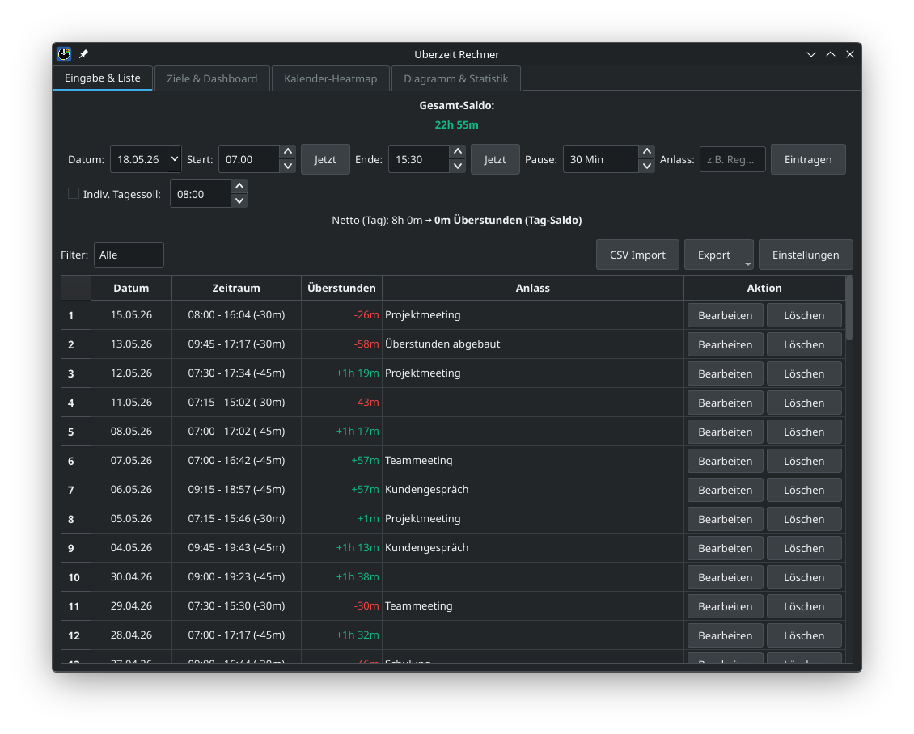
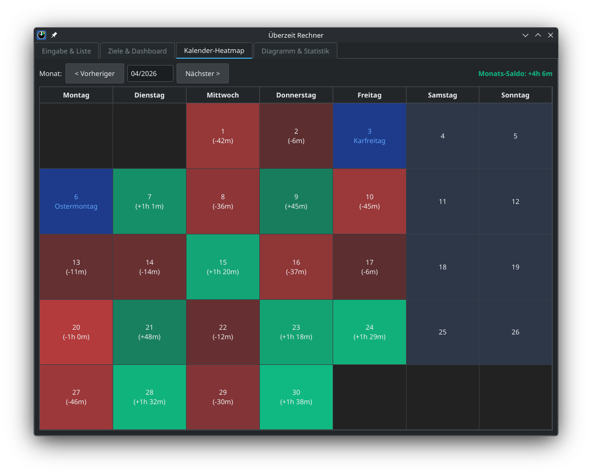
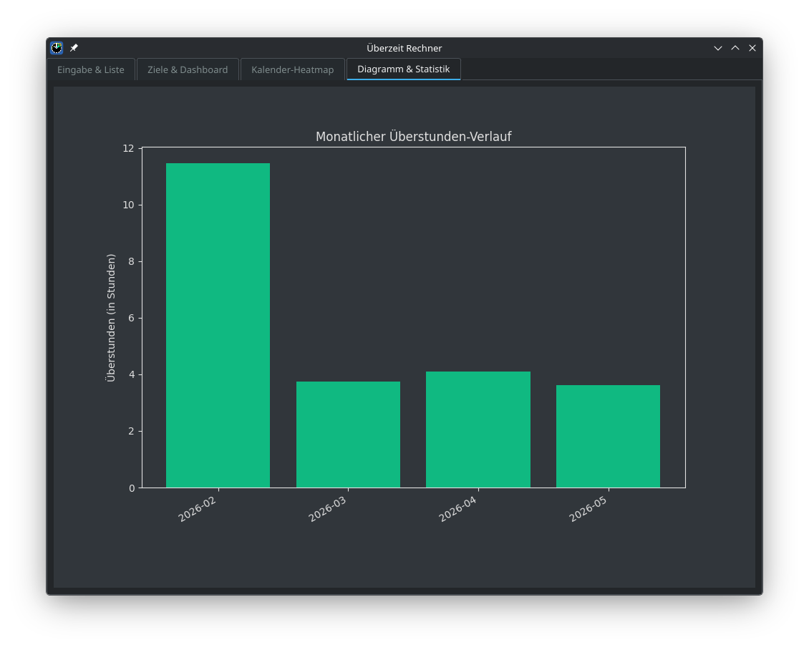
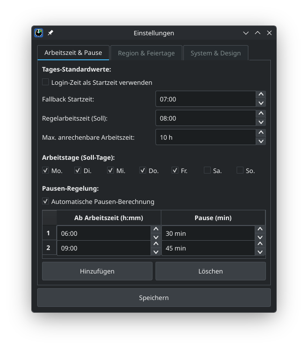
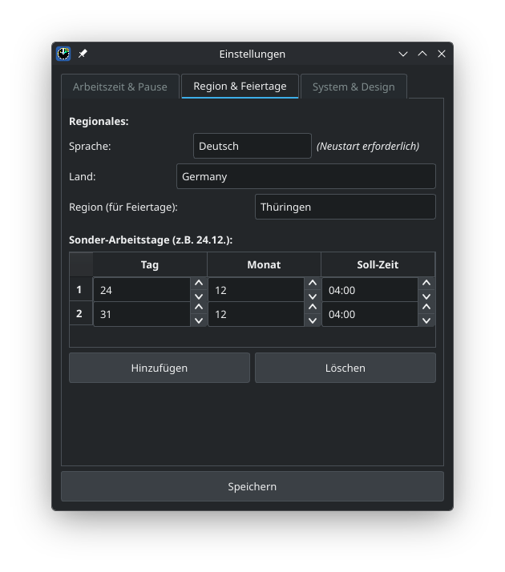
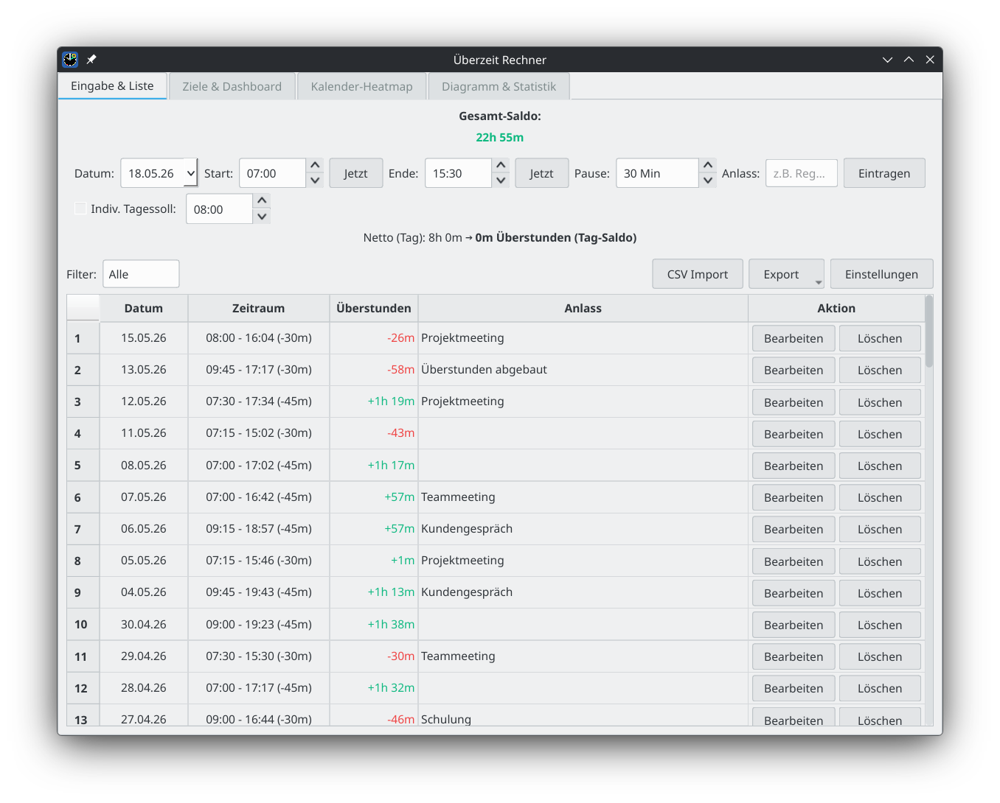

# Überzeit Rechner – Overtime Tracker

A powerful, privacy-first overtime tracking desktop application with a graphical interface (PyQt6). Track your working hours, breaks, and overtime precisely — with visualizations, export options, and flexible target configuration.

All data is stored **locally** in a SQLite database. No cloud, no telemetry.

---

## 📸 Screenshots



| Kalender-Heatmap | Diagramm & Statistik |
|---|---|
|  |  |

| Einstellungen – Arbeitszeit | Einstellungen – Region |
|---|---|
|  |  |

**Light Mode**



---

## ✨ Features

- **Precise time tracking** — Record start/end times and breaks. Manual correction entries are also supported.
- **Flexible daily targets**
  - Override the target hours for individual entries directly at the time of input.
  - Define recurring special days with reduced targets (e.g. Christmas Eve and New Year's Eve at 4h) in settings.
  - Set a standard target for regular working days.
- **Smart holiday & weekend logic**
  - Supports public holidays for many countries and regions (configurable via settings).
  - Configure which weekdays are your regular working days (e.g. Mon–Fri).
  - Work on days off, weekends, or public holidays is automatically counted as 100% overtime (target = 0).
- **Automatic break calculation** — Calculates statutory break times automatically (30 min after 6h, 45 min after 9h).
- **Login time detection** — Optionally uses the OS login time (Windows, Linux, macOS) as the default start time.
- **Midnight shift support** — Entries spanning midnight are automatically split into two entries across the correct dates.
- **Overlap detection** — Live preview warns you immediately if a new entry would overlap with an existing one.
- **Visualizations**
  - **Calendar heatmap** — Color-coded monthly overview of your balance. Weekends and days off are highlighted.
  - **Statistics charts** — Monthly overtime trend charts.
- **Overtime goal tracking (Dashboard)** — Set a savings goal (e.g. hours for a vacation) and track progress. Public holidays and configured working days are taken into account automatically.
- **Dark mode** — Light and dark theme support (Breeze style).
- **Data export** — Export your data as CSV, Excel (.xlsx), or PDF.
- **Privacy** — All data is stored locally in `ueberstunden_daten.db`. No cloud, no tracking.

---

## 📥 Download

Pre-built binaries are available on the [Releases](../../releases) page:

| Platform | File |
|---|---|
| Linux (x86_64) | `Überstundenrechner-linux-x86_64.tar.gz` |
| Windows (x86_64) | `Überstundenrechner-windows-AMD64.zip` |
| macOS (Apple Silicon) | `Überstundenrechner-macos-arm64.dmg` |

A **sample database** (`demo_daten.db`) with realistic demo data is also available on the [Releases](../../releases) page. Copy it next to the executable and select it under Settings → Database location.

### Linux
```bash
tar -xzf Überstundenrechner-linux-x86_64.tar.gz
cd Überstundenrechner
./Überstundenrechner
```

### Windows
Extract the `.zip` file and run `Überstundenrechner.exe`.

### macOS
> **Note:** The app is not signed with an Apple Developer certificate. macOS Gatekeeper may show a "damaged" warning.
>
> **Fix:** Open Terminal and run:
> ```bash
> codesign --force --deep --sign - /Applications/Überstundenrechner.app
> ```
> Then open the app normally. Alternatively, go to **System Settings → Privacy & Security** and click **Open Anyway**.

---

## 🚀 Running from Source

### Requirements
- Python 3.11 or newer

### Setup

1. Clone the repository:
   ```bash
   git clone https://github.com/Bluelightde/ueberzeit-rechner.git
   cd ueberzeit-rechner
   ```

2. Create a virtual environment:
   ```bash
   python -m venv venv
   source venv/bin/activate        # Linux / macOS
   venv\Scripts\activate           # Windows
   ```

3. Install dependencies:
   ```bash
   pip install -r requirements.txt
   ```

4. Run the app:
   ```bash
   python main.py
   ```

---

## ⚙️ First-Time Setup

1. Open **Settings**.
2. Select your **country** and **region/state** (important for correct public holiday calculation).
3. Set your **standard daily target** and your regular **working days**.
4. Define **special days** with reduced targets under Settings (e.g. Dec 24 and Dec 31 at 4h).
5. Optionally enable **Dark Mode** or **Login Time Detection**.

---

## 📦 Building a Standalone Executable

Use the included build script — it works on Linux, macOS, and Windows:

```bash
python build.py
```

The output will be placed in the `dist/` folder. The script automatically installs dependencies, runs PyInstaller, and packages the result as `.tar.gz` (Linux), `.zip` (Windows), or `.dmg` (macOS).

### Automated builds via GitHub Actions

Every push to `main` and every version tag (`v*`) triggers an automated build for all three platforms via GitHub Actions. Built artifacts are attached to the corresponding [Release](../../releases).

To create a new release:
```bash
git tag v1.2.0
git push origin v1.2.0
```

---

## 🗂️ Project Structure

```
main.py            — Entry point, main window, theme handling
logic.py           — Core calculation logic (net time, breaks, overtime)
database.py        — SQLite database management
models.py          — Data structures (WorkEntry)
config.py          — Paths and constants
i18n.py            — Internationalization support
ui_components.py   — Custom widgets and delegates
dialogs.py         — Settings and edit dialogs
exports.py         — CSV, Excel, and PDF export
tabs/
  main_tab.py      — Data entry and list view
  goals_tab.py     — Overtime goals and dashboard
  calendar_tab.py  — Calendar heatmap
  stats_tab.py     — Statistics and charts
```

---

## 💾 Data Storage

| File | Description |
|---|---|
| `ueberstunden_daten.db` | SQLite database (next to the executable) |
| `ueberstunden_settings.json` | App settings (JSON) |

Both files are created automatically on first launch in the same directory as the executable (or script).

---

## 📜 License

This project is licensed under the MIT License.

---

*Developed with the assistance of [Claude](https://claude.ai) by Anthropic.*
